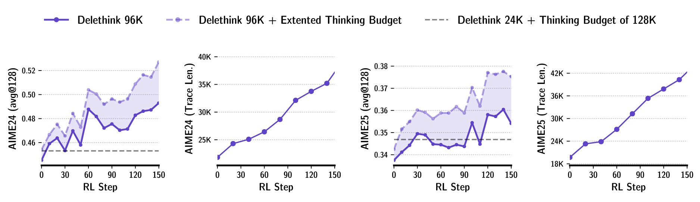

<div align="center">

# 🚀 INFINICHUNK

### **Scale Long-Form Reasoning to Infinite Lengths with Linear Compute**

[](https://www.python.org/downloads/)
[](LICENSE)
[](https://github.com/volcengine/verl)

<br>

<!-- 1. HERO ANIMATION (Smooth SVG #1) -->


</div>

---

## ⚡ The Problem: Quadratic Wall

Traditional LLM reasoning hits a hard wall. As you think longer, costs explode quadratically.

<!-- 2. COMPARISON DIAGRAM (Informative Image #1) -->
<p align="center">
  
</p>

## 💡 The Solution: Constant Memory

INFINICHUNK keeps memory flat, no matter how long the reasoning chain grows.

<!-- 3. MEMORY DIAGRAM (Informative Image #2) -->
<p align="center">
  
</p>

---

## 🏗️ System Architecture

How we train it at scale using Ray and PPO.

<!-- 4. ARCHITECTURE ANIMATION (Smooth SVG #2) -->
<p align="center">
  
</p>

---

## 📊 Performance Results

We achieve strong reasoning performance while slashing costs.

<!-- 5. RESULTS CHART (Informative Image #3) -->
<p align="center">
  
</p>

<!-- 6. DETAILED RESULTS (Informative Image #4) -->
<p align="center">
  
</p>

---

## 🔍 Deep Dive: The Logic

<!-- 7. DETAILED FLOW (Informative Image #5) -->
<p align="center">
  
</p>

---

## 🚀 Quick Start

### Installation

```bash
curl -LsSf https://astral.sh/uv/install.sh | sh
uv venv --python=3.10 && source .venv/bin/activate
uv pip install torch==2.5.1 --index-url https://download.pytorch.org/whl/cu124
uv pip install -e ".[sglang]"
```

### Run Demo

```bash
python infinichunk_tracing_demo.py \
  --model deepseek-ai/DeepSeek-R1-Distill-Qwen-1.5B \
  --infinichunk_context_size 8192
```

### Train

```bash
python -m verl.trainer.main_policy_iteration \
  --config-name=r1d-1.5b_deepscaler_infinichunk_24k
```

---

<div align="center">

**[VinePPO](https://github.com/DivyamTalwar/VinePPO)** • **[VERL](https://github.com/volcengine/verl)** • **[SGLang](https://github.com/sgl-project/sglang)**

Made with 💜 by Divyam Talwar

</div>
