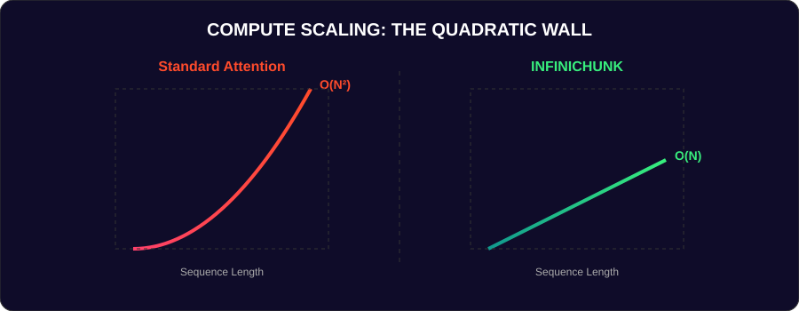
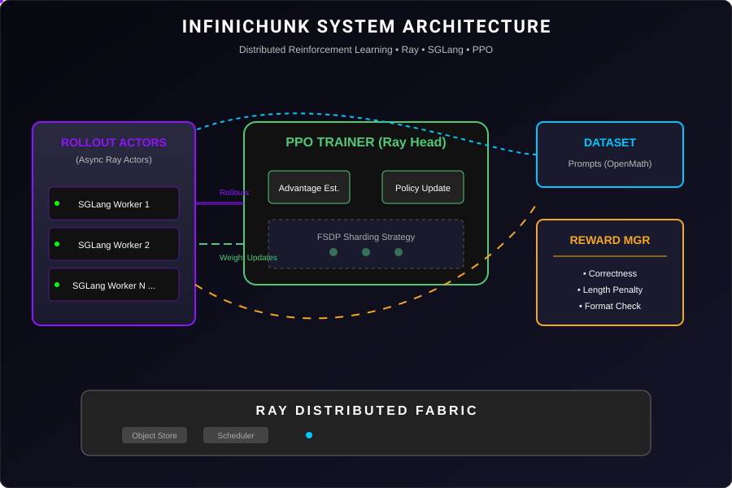
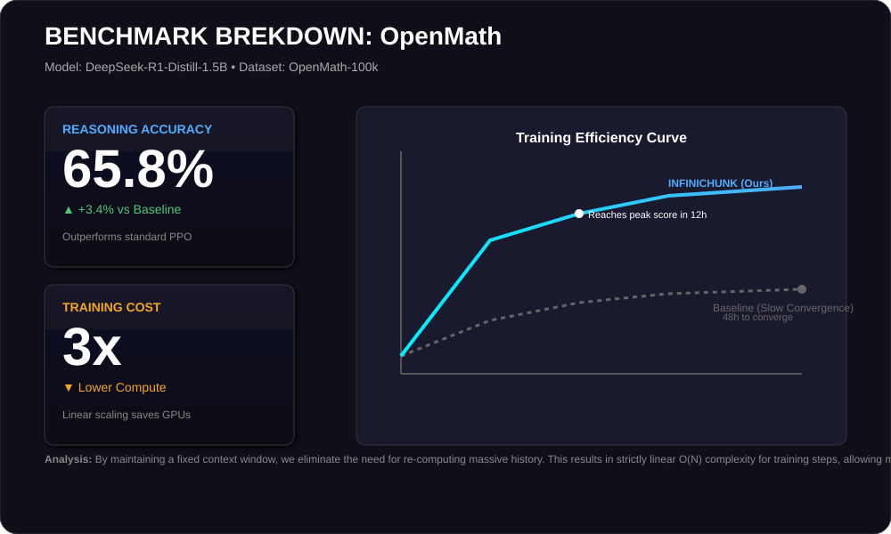
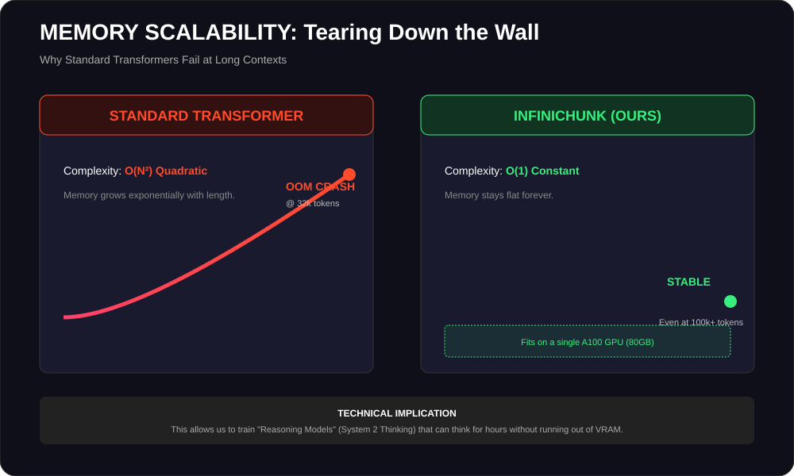

<div align="center">

# 🚀 INFINICHUNK

### **Scale Long-Form Reasoning to Infinite Lengths with Linear Compute**

[](https://www.python.org/downloads/)
[](LICENSE)
[](https://github.com/volcengine/verl)

<br>



</div>

---

## 🎯 What is INFINICHUNK?

**INFINICHUNK** enables LLMs to perform **extended chain-of-thought reasoning** across **virtually unlimited token lengths** while keeping compute and memory costs **linear** instead of quadratic.

### The Quadratic Barrier
Traditional transformer reasoning faces a critical bottleneck: memory and compute scale as **O(N²)**. As reasoning chains grow longer, they become prohibitively expensive.

<p align="center">
  
</p>

### The Linear Solution
INFINICHUNK breaks reasoning into **fixed-size chunks** with intelligent state carryover. This ensures that memory usage remains constant, no matter how long the model thinks.

<p align="center">
  
</p>

---

## 🏗️ System Architecture

Our training stack is built for massive scale, leveraging **Ray** for distributed rollout management and **PPO** for policy optimization.

<p align="center">
  
</p>

### Core Components

| Component | Purpose |
|-----------|---------|
| **Agent Loop** | Manages chunked generation cycles and state carryover logic. |
| **Rollout Engine** | High-throughput async inference using **SGLang** or **vLLM**. |
| **Trainer** | Distributed PPO optimization supporting GRPO and FSDP sharding. |

---

## 📊 Performance Results

We achieve strong reasoning performance on math benchmarks while slashing training costs by **3x**.

<p align="center">
  
</p>

<p align="center">
  
</p>

---

## 🔄 How It Works (Deep Dive)

The core mechanism relies on a "Generate → Trim → Carryover" loop.

<p align="center">
  
</p>

### Step-by-Step Algorithm
1.  **Initial Generation**: Generate the first chunk with full context `C`.
2.  **Intelligent Trimming**: Keep the `head` (system prompt) and vital `tail` tokens.
3.  **State Carryover**: Append the trimmed state to form the context for the next chunk.
4.  **Recursion**: Repeat until the final answer is reached.

---

## ⚙️ Configuration

### Key Parameters

| Parameter | Symbol | Description | Example |
|-----------|--------|-------------|---------|
| Context Size | `C` | Max tokens per chunk | 8,192 |
| Carryover Size | `m` | Tokens carried between chunks | 4,096 |
| Keep Head | - | Preserved tokens from first response | 100 |

### Recommended Configs

| Config File | Budget | Use Case |
|-------------|--------|----------|
| `r1d-1.5b_deepscaler_infinichunk_24k` | 24K | Standard Math Reasoning |
| `r1d-1.5b_openmath_infinichunk_96k` | 96K | Extended Deep Thought |

---

## 🚀 Quick Start

### 1. Installation

```bash
curl -LsSf https://astral.sh/uv/install.sh | sh
uv venv --python=3.10 && source .venv/bin/activate
uv pip install torch==2.5.1 --index-url https://download.pytorch.org/whl/cu124
uv pip install -e ".[sglang]"
```

### 2. Run Inference Demo

```bash
python infinichunk_tracing_demo.py \
  --model deepseek-ai/DeepSeek-R1-Distill-Qwen-1.5B \
  --infinichunk_context_size 8192
```

### 3. Start Training

```bash
python -m verl.trainer.main_policy_iteration \
  --config-name=r1d-1.5b_deepscaler_infinichunk_24k
```

---

## ❓ FAQ

<details>
<summary><b>Does this work with any model?</b></summary>
Yes! You can plug in almost any base model (Qwen, Llama, Mistral) by changing the <code>model.path</code> in the config.
</details>

<details>
<summary><b>How do I scale to more GPUs?</b></summary>
Export <code>TREETUNEV__NUM_GPUS_PER_NODE=8</code> before running the training script to utilize full nodes.
</details>

---

<div align="center">

**[VinePPO](https://github.com/DivyamTalwar/VinePPO)** • **[VERL](https://github.com/volcengine/verl)** • **[SGLang](https://github.com/sgl-project/sglang)**

Made with 💜 by Divyam Talwar

</div>
