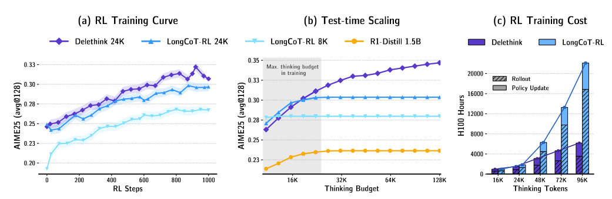
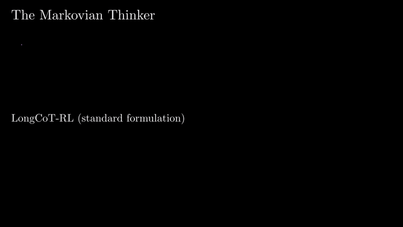
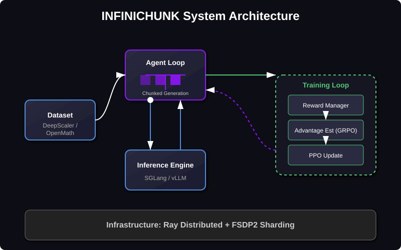
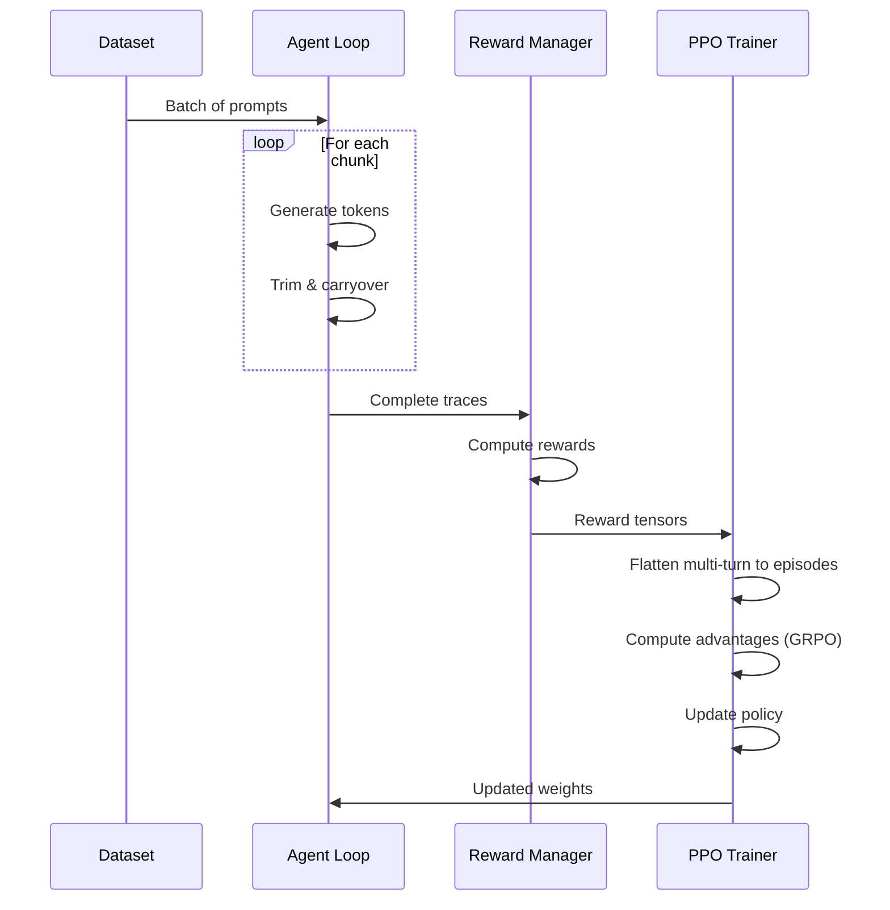

<div align="center">

# 🚀 INFINICHUNK

### **Scale Long-Form Reasoning to Infinite Lengths with Linear Compute**

*Chunked reasoning with fixed-state rollouts — train models that think longer without quadratic cost*

[](https://www.python.org/downloads/)
[](LICENSE)
[](https://github.com/volcengine/verl)

---

[**Quick Start**](#-quick-start) •
[**How It Works**](#-how-infinichunk-works) •
[**Configuration**](#%EF%B8%8F-configuration) •
[**Installation**](#-installation) •
[**Training**](#-training)

</div>

---

## 🎯 What is INFINICHUNK?

**INFINICHUNK** enables LLMs to perform **extended chain-of-thought reasoning** across **virtually unlimited token lengths** while keeping compute and memory costs **linear** instead of quadratic.

### The Problem

Traditional transformer reasoning faces a critical bottleneck:
- **Quadratic scaling**: Self-attention costs grow as O(n²) with sequence length
- **Memory explosion**: Long reasoning traces require massive GPU memory
- **Training inefficiency**: Can't efficiently train on 50K-100K+ token reasoning chains

### The Solution

INFINICHUNK breaks reasoning into **fixed-size chunks** with **intelligent state carryover**:

```
┌─────────────────────────────────────────────────────────────────────────────┐
│  Traditional: [Prompt] → [Response of N tokens] → O(N²) compute            │
├─────────────────────────────────────────────────────────────────────────────┤
│  INFINICHUNK: [Prompt] → [Chunk 1] → [Chunk 2] → ... → [Answer] → O(N)     │
│                              ↓           ↓                                  │
│                         [Carryover]  [Carryover]   (Fixed state size m)    │
└─────────────────────────────────────────────────────────────────────────────┘
```

---

## 📊 Key Results

<p align="center">
  
</p>

| Configuration | Thinking Budget | Performance | Training Cost |
|--------------|-----------------|-------------|---------------|
| **INFINICHUNK-24K** | 24K tokens | Strong math reasoning | ~3x cheaper than standard |
| **INFINICHUNK-96K** | 96K tokens | Extended reasoning | Linear scaling maintained |

**Benefits:**
- ✅ **Linear memory**: Fixed context window per chunk
- ✅ **Linear compute**: No quadratic attention over full history  
- ✅ **Unlimited reasoning**: Chain as many chunks as needed
- ✅ **Drop-in training**: Works with standard PPO/GRPO algorithms

---

## 🔄 How INFINICHUNK Works

<p align="center">
  
</p>

### The Chunking Algorithm

<p align="center">
  
</p>

### Step-by-Step Process

1. **Initial Generation**: Generate first chunk with full context budget `C` tokens
2. **Intelligent Trimming**: Keep `keep_head` tokens from start + `keep_tail` sliding window
3. **State Carryover**: Append trimmed state to original prompt as context
4. **Continue Reasoning**: Generate next chunk with `C-m` new tokens
5. **Repeat**: Continue until model produces EOS or max iterations reached

### Key Parameters

| Parameter | Symbol | Description | Example |
|-----------|--------|-------------|---------|
| Context Size | `C` | Max tokens per chunk | 8,192 |
| Carryover Size | `m` | Tokens carried between chunks | 4,096 |
| Keep Head | - | Preserved tokens from first response | 100 |
| Max Turns | `I` | Maximum number of chunks | 5-23 |

**Total Reasoning Budget Formula:**
```
Total = C + (I - 1) × (C - m)

Example (24K): 8,192 + (5-1) × (8,192 - 4,096) = 24,576 tokens
Example (96K): 8,192 + (23-1) × (8,192 - 4,096) = 98,304 tokens
```

---

## 🏗️ Architecture Overview

<p align="center">
  
</p>

### Core Components

| Component | File | Purpose |
|-----------|------|---------|
| **Agent Loop** | `verl/experimental/agent_loop/infinichunk_agent_loop.py` | Manages chunked generation with state carryover |
| **Trimmer** | `verl/experimental/agent_loop/infinichunk_trimmers.py` | Progressive head+tail token trimming |
| **Trainer** | `verl/trainer/infinichunk_ppo/ray_trainer.py` | Distributed PPO training with trace flattening |
| **Reward Manager** | `verl/workers/reward_manager/infinichunk.py` | Specialized reward computation for chunked traces |

---

## 🚀 Quick Start

### 1. Train INFINICHUNK-24K (24,576 token reasoning budget)

```bash
python -m verl.trainer.main_policy_iteration \
  --config-name=r1d-1.5b_deepscaler_infinichunk_24k
```

### 2. Train INFINICHUNK-96K (98,304 token reasoning budget)

```bash
python -m verl.trainer.main_policy_iteration \
  --config-name=r1d-1.5b_openmath_infinichunk_96k
```

### 3. Run Inference Demo

```bash
python infinichunk_tracing_demo.py \
  --model deepseek-ai/DeepSeek-R1-Distill-Qwen-1.5B \
  --infinichunk_context_size 8192 \
  --infinichunk_carryover_size 4096 \
  --infinichunk_iteration_cap 5
```

---

## 📦 Installation

### Option 1: Using uv (Recommended)

```bash
# Install uv
curl -LsSf https://astral.sh/uv/install.sh | sh

# Setup environment
cd INFINICHUNK
uv venv --python=3.10
source .venv/bin/activate

# Install dependencies (see INSTALLATION.md for full steps)
uv pip install torch==2.7.1 --index-url https://download.pytorch.org/whl/cu126
uv pip install -e ".[sglang]"
```

### Option 2: Docker

```bash
# Build with SGLang backend
docker build -f docker/Dockerfile.app.sglang -t infinichunk-sglang .

# Run
docker run --gpus all --rm -it \
  -v $PWD:/workspace/infinichunk \
  -w /workspace/infinichunk \
  infinichunk-sglang bash
```

> 📖 See [INSTALLATION.md](INSTALLATION.md) for detailed setup instructions.

---

## ⚙️ Configuration

### Key Configuration Files

| Config | Use Case | Total Budget |
|--------|----------|--------------|
| `r1d-1.5b_deepscaler_infinichunk_24k.yaml` | Standard training | 24K tokens |
| `r1d-1.5b_openmath_infinichunk_96k.yaml` | Extended reasoning | 96K tokens |

### Essential Parameters

```yaml
# Chunking Configuration
algorithm:
  infinichunk:
    keep_head: 100                    # Tokens preserved from first response
    keep_tail: 4096                   # Sliding window carryover
    intermediate_max_new_tokens: 4096 # Per-chunk budget after first
    fixed_num_optim_steps: 2          # Fixed optimization steps per iteration

# Rollout Configuration  
actor_rollout_ref:
  rollout:
    mode: async                       # Async rollout for efficiency
    multi_turn:
      max_assistant_turns: 5          # Max chunks (I)
    calculate_log_probs: true

# Training Configuration
  actor:
    loss_agg_mode: seq-mean-token-norm-trace-length
    clip_ratio_high: 0.26
```

### Override Examples

```bash
# Custom chunk count
python -m verl.trainer.main_policy_iteration \
  --config-name=r1d-1.5b_deepscaler_infinichunk_24k \
  actor_rollout_ref.rollout.multi_turn.max_assistant_turns=10

# Custom carryover
python -m verl.trainer.main_policy_iteration \
  --config-name=r1d-1.5b_deepscaler_infinichunk_24k \
  algorithm.infinichunk.keep_head=200
```

---

## 🎓 Training

### Reward Strategies

INFINICHUNK supports multiple reward formulations:

| Reward Manager | Description |
|---------------|-------------|
| `infinichunk` | Standard correctness-based reward |
| `tenary_infinichunk` | +1 correct, -1 wrong, 0 clipped |
| `chunk_encourage_infinichunk` | Bonus for using more chunks |
| `cosine_infinichunk` | Cosine-shaped reward based on length |

### Training Flow



### Monitoring

Training logs key INFINICHUNK metrics:
- `infinichunk/trace_scores/*` - Reward statistics
- `infinichunk/trace_num_turns/*` - Chunk usage distribution  
- `infinichunk/trace_lengths/*` - Total tokens generated
- `infinichunk/trace_has_eos/*` - Completion rate

---

## 📁 Repository Structure

```
INFINICHUNK/
├── 📄 README.md                          # This file
├── 📄 INSTALLATION.md                    # Detailed setup guide
├── 📄 infinichunk_tracing_demo.py        # Standalone inference demo
│
├── 📂 assets/                            # Diagrams and figures
├── 📂 docker/                            # Production Dockerfiles
├── 📂 examples/                          # Training scripts
│   ├── infinichunk_template.sh
│   └── reproduce_rl_training/
│
└── 📂 verl/                              # Core library
    ├── 📂 experimental/
    │   └── 📂 agent_loop/                # INFINICHUNK agent loops
    │       ├── infinichunk_agent_loop.py
    │       └── infinichunk_trimmers.py
    │
    ├── 📂 trainer/
    │   ├── 📂 config/                    # Hydra configurations
    │   ├── 📂 infinichunk_ppo/           # INFINICHUNK trainer
    │   └── 📂 ppo/                       # Core PPO algorithms
    │
    └── 📂 workers/
        └── 📂 reward_manager/            # Reward computation
            └── infinichunk.py
```

---

## ❓ FAQ

<details>
<summary><b>How do I debug with smaller batch sizes?</b></summary>

```bash
python -m verl.trainer.main_policy_iteration \
  --config-name=r1d-1.5b_deepscaler_infinichunk_24k \
  trainer.val_before_train=False \
  actor_rollout_ref.rollout.n=2 \
  actor_rollout_ref.actor.ppo_mini_batch_size=4 \
  data.train_batch_size=4
```
</details>

<details>
<summary><b>Where is the loss aggregation implemented?</b></summary>

See `verl/trainer/ppo/core_algos.py`:
- `agg_loss()` - Standard aggregation modes
- `agg_loss_with_trace_lengths()` - Trace-length normalized aggregation
</details>

<details>
<summary><b>Can I use a different base model?</b></summary>

Yes! Override the model path:
```bash
python -m verl.trainer.main_policy_iteration \
  --config-name=r1d-1.5b_deepscaler_infinichunk_24k \
  actor_rollout_ref.model.path=your-model/path
```
</details>

<details>
<summary><b>How do I scale to more GPUs?</b></summary>

Set environment variables:
```bash
export TREETUNEV__NNODE=4  # Number of nodes
export TREETUNEV__NUM_GPUS_PER_NODE=8  # GPUs per node
```
</details>

---

## 🙏 Acknowledgements

INFINICHUNK is built on the shoulders of giants:

- **[VERL](https://github.com/volcengine/verl)** - Volcano Engine RL framework
- **[SGLang](https://github.com/sgl-project/sglang)** - Efficient LLM serving
- **[VinePPO](https://github.com/McGill-NLP/VinePPO)** - Tree-based RL algorithms

---

<div align="center">

**⭐ Star this repo if INFINICHUNK helps your research!**

Made with 💜 for the LLM reasoning community

</div>
